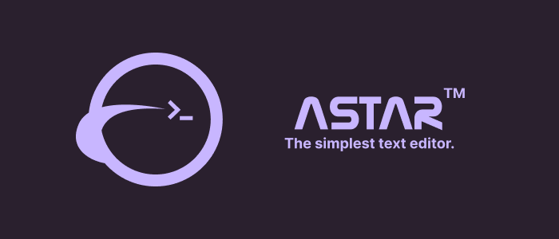

---

# Astar
A Nano and Vim-like TUI text editor based on the [Kilo Editor](https://viewsourcecode.org/snaptoken/kilo/index.html), It is meant to be easily configurable, incredibly light and user-friendly. It'll be available by default on the [Titanium OS]().

# Roadmap

* [ ] Stable syntax highlighting
* [ ] Comments and Docs !
* [ ] Navigation mapping
* [ ] Language support:
    + * [ ] Bash
    + * [ ] Python
    + * [ ] Odin
    + * [ ] Nasm (?)
* [ ] Config file
* [ ] Ncurses backend

***NB: List subject to changes***

## Why ?
It's fuuuuuun ! No really, just for learning low-level C programs and making my very own software ^^

# How does it run ?
For the time, it's only available on Unix terminal, so if you are on Windows, you will need to install [WSL](https://learn.microsoft.com/fr-fr/windows/wsl/install).

Once you have a Unix terminal, just get the latest release, and then run:
```bash
astar <your_file.xyz> 
```
or 
```bash
astar 
```

# Development

### Dependencies
You just need `make` and a C compiler, I used `gcc` but the Makefile is independent regarding of this, take what you want !

### Compilation
You just have to clone or fork the repo. If you don't use Jetbrain's IDEs, you can delete the .idea folder. For compilation and running, you just need to run:
```bash
make
```
And then: (the executable will be in the /bin folder)
```bash
./astar <your_filename.xyz>
```

Nice, it's workiin' !!

**Later I'll probably add GitHub Actions to run some tests on each commits...**

# Issues/Contributing
Templates are coming soon ! For the moment just make a fork, branch and then report/propose explicitly.

